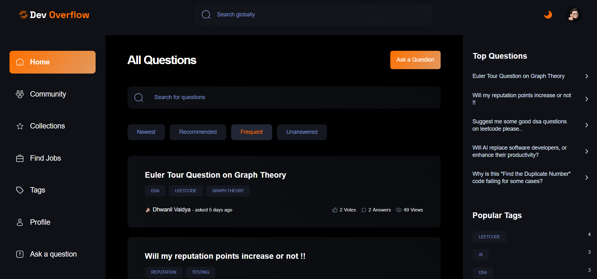
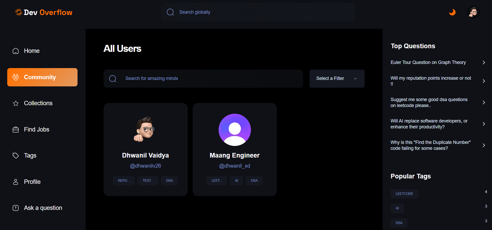
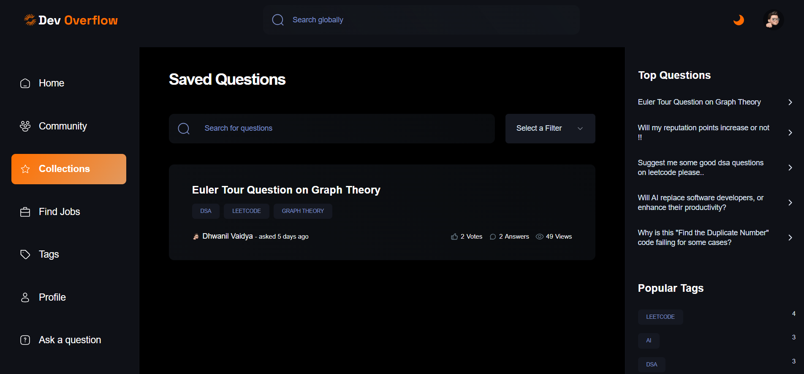
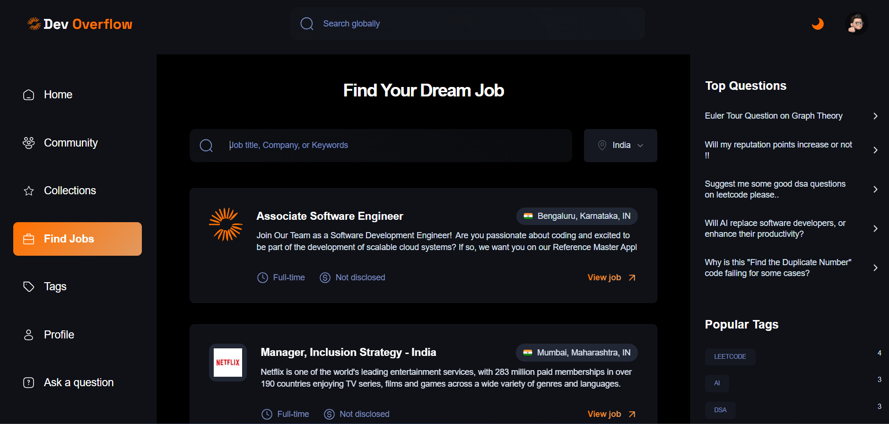
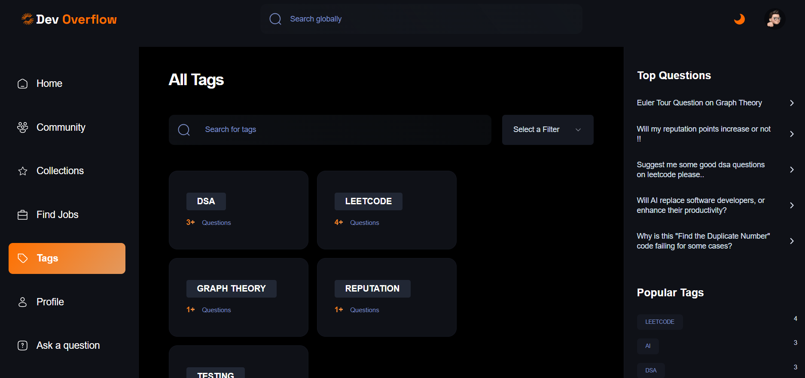
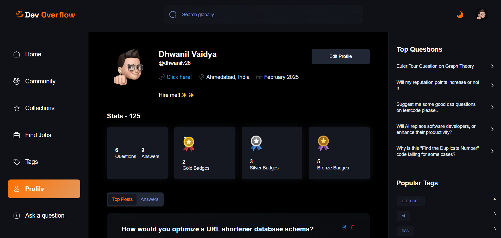
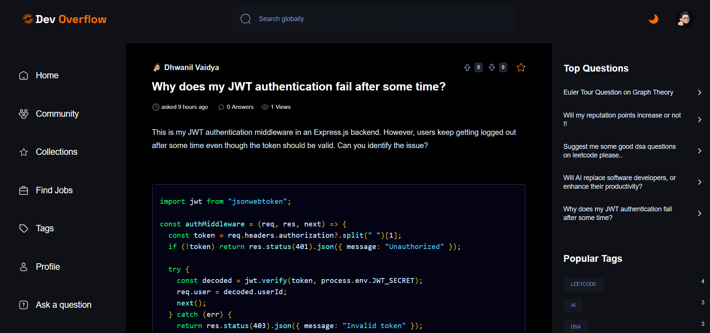

# Devoverflow

Devoverflow is a full-stack developer community platform inspired by Stack Overflow. It allows developers to ask and answer technical questions, interact with other users, and engage with various features like voting, saving questions, filtering, and more.

## Features

### 🔐 Authentication & User Management

- **Clerk Authentication**: Secure authentication with Clerk for user sign-up, login, and session management.
- **Customizable User Profiles**: Users can update their name, username, bio, profile picture, and more.
- **User Reputation System**: Reputation points based on contributions and interactions.

### 📝 Rich Q&A System

- **Ask Questions**: Users can post questions with rich text formatting using TinyMCE.
- **Answer Questions**: Provide detailed answers, including code snippets.
- **AI-Generated Answers**: Integrated with Google's Gemini API to generate AI-powered responses.
- **Voting System**: Upvote/downvote questions and answers.
- **Save Questions**: Users can save questions for later reference.
- **Hot & Recommended Questions**: Personalized and trending questions displayed in the right sidebar and also on the home page.
- **Pagination & Search**: Efficient question browsing with local search and filters.

### 🔍 Tagging & Filtering

- **Dynamic Tag System**: Each question can be tagged with relevant technologies.
- **Popular Tags**: Most used tags are highlighted in the sidebar.
- **Filter & Sorting Options**: Users can sort questions based on newest, most voted, or most viewed.

### 💼 Job Search System

- **Browse Jobs**: A fully integrated job search system that allows users to explore software development jobs.
- **Filtering & Sorting**: Jobs can be filtered by title, location, and experience level for a personalized experience.
- **Job Details & Applications**: Users can view job descriptions and navigate to application pages directly.

### 📊 Community & User Interaction

- **User Leaderboard**: Displays the most active and high-reputation users.
- **User Profiles & Contributions**: View all questions, answers, and tags interacted with by a specific user.
- **Interacted Tags**: Users can track their most engaged tags.

### 🌙 Dark Mode Support

- **Next-Themes Integration**: Provides a seamless light/dark mode experience.

### 🚀 Performance & Optimization

- **Dynamic Imports**: Used for improved page loading performance.
- **Server Actions**: Optimized server-side processing for enhanced performance.
- **MongoDB & Mongoose**: Efficient database handling for scalability.
- **SWR (Optional)**: Data fetching with caching capabilities.

## 📸 Demo Screenshots

### 🏠 Home Page


### 🌍 Community Page 


### 📚 Collections Page  


### 💼 Jobs Page  


### 🔖 Tags Page  


### 👤 Profile Page 


### ❓ Question Details Page  



## Tech Stack

### 🌐 Frontend

- **Next.js 14**: Server and client rendering capabilities.
- **React 18**: Component-based UI development.
- **Tailwind CSS**: Modern utility-first styling.
- **ShadCN UI**: Beautiful and customizable UI components.

### 🛠 Backend & Database

- **Next.js Server Actions**: API routes and server-side functionalities.
- **MongoDB & Mongoose**: NoSQL database for data storage.
- **Clerk Authentication**: User authentication and session handling.
- **Google's Gemini API**: AI-powered answer generation.
- **JSearch API**: Provides real-time job listings and search capabilities.

### 📦 Additional Libraries

- **TinyMCE**: Rich text editor for question descriptions.
- **PrismJS**: Syntax highlighting for code snippets.
- **Query-String**: URL query parameter handling.
- **Zod**: Schema validation.


## Installation & Setup

### Prerequisites

- Node.js (v18+)
- MongoDB Database
- Clerk Account for Authentication
- Google Gemini API Key for AI Answer generation

### Steps to Run Locally

```bash
git clone https://github.com/Dhwanilv26/devoverflow-main.git
cd devoverflow-main
npm install
npm run dev
```

## Deployment

### Deploying to Vercel

```bash
npm install -g vercel
vercel login
vercel
```


## Contributing

Contributions are welcome! Feel free to submit issues or pull requests to improve Devoverflow.

## Author

Built by **Dhwanil Vaidya**

